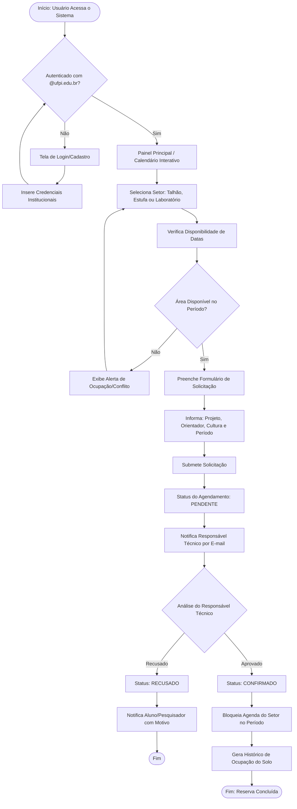
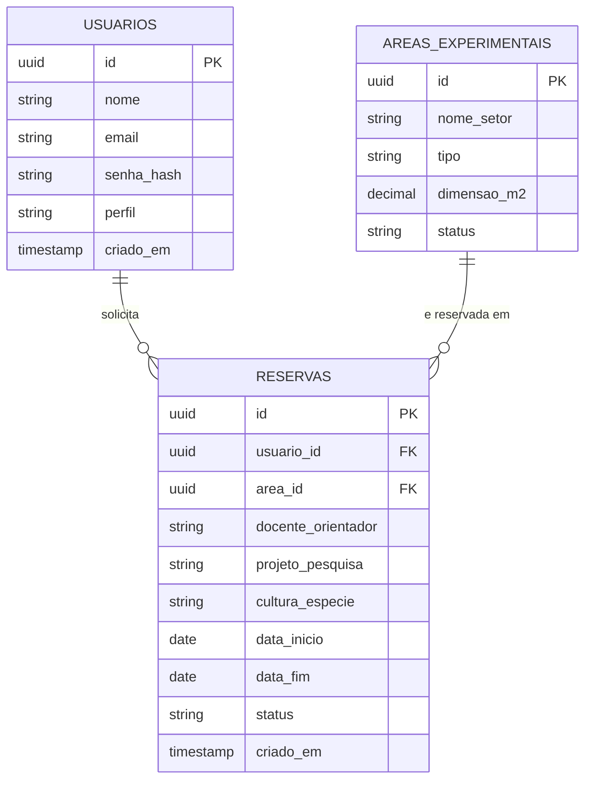

# 🏗️ Relatório de Arquitetura e Modelagem do Sistema

> **Projeto:** AgroReserva CPCE
> **Fase:** Etapa 2 — Planejamento Operacional e Modelagem
> **Status:** 🟢 Concluído

---

## 📐 1. Fluxograma do Processo

O fluxograma abaixo ilustra o processo completo, desde o acesso do usuário até a confirmação (ou recusa) da reserva de uma área experimental.



---

## 🗄️ 2. Modelagem de Dados

### Diagrama Entidade-Relacionamento



### Esquema Relacional (PostgreSQL)

```sql
-- Tabela de Usuários
CREATE TABLE usuarios (
    id UUID PRIMARY KEY DEFAULT gen_random_uuid(),
    nome VARCHAR(100) NOT NULL,
    email VARCHAR(100) UNIQUE NOT NULL,
    senha_hash VARCHAR(255) NOT NULL,
    perfil VARCHAR(20) NOT NULL CHECK (perfil IN ('discente', 'docente', 'tecnico')),
    criado_em TIMESTAMP DEFAULT CURRENT_TIMESTAMP
);

-- Tabela de Áreas Experimentais
CREATE TABLE areas_experimentais (
    id UUID PRIMARY KEY DEFAULT gen_random_uuid(),
    nome_setor VARCHAR(100) NOT NULL,
    tipo VARCHAR(30) NOT NULL CHECK (tipo IN ('talhao', 'estufa', 'laboratorio')),
    dimensao_m2 DECIMAL(10,2),
    status VARCHAR(20) DEFAULT 'ativo' CHECK (status IN ('ativo', 'manutencao'))
);

-- Tabela de Reservas
CREATE TABLE reservas (
    id UUID PRIMARY KEY DEFAULT gen_random_uuid(),
    usuario_id UUID REFERENCES usuarios(id),
    area_id UUID REFERENCES areas_experimentais(id),
    docente_orientador VARCHAR(100) NOT NULL,
    projeto_pesquisa VARCHAR(200) NOT NULL,
    cultura_especie VARCHAR(100) NOT NULL,
    data_inicio DATE NOT NULL,
    data_fim DATE NOT NULL,
    status VARCHAR(20) DEFAULT 'pendente' CHECK (status IN ('pendente', 'confirmado', 'recusado')),
    criado_em TIMESTAMP DEFAULT CURRENT_TIMESTAMP
);
```

---

## 🖥️ 3. Protótipo de Telas (Sugestão — Figma)

1. **Login/Cadastro** — autenticação com e-mail institucional.
2. **Calendário Interativo** — visão geral de disponibilidade por setor.
3. **Formulário de Solicitação** — período, projeto, orientador, cultura.
4. **Painel do Responsável Técnico** — aprovar, recusar ou ajustar solicitações.
5. **Relatórios de Ocupação** — exportação em PDF do histórico de uso do solo.

---
